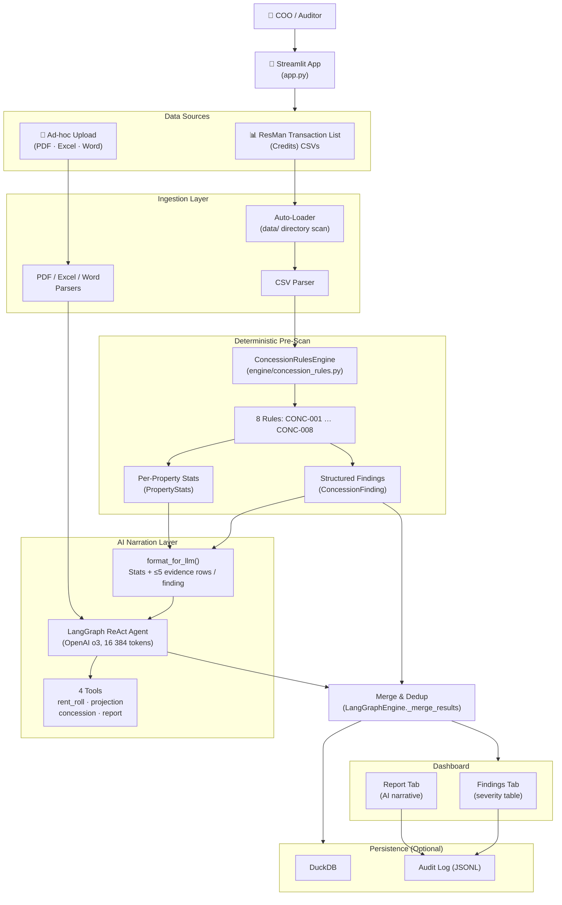
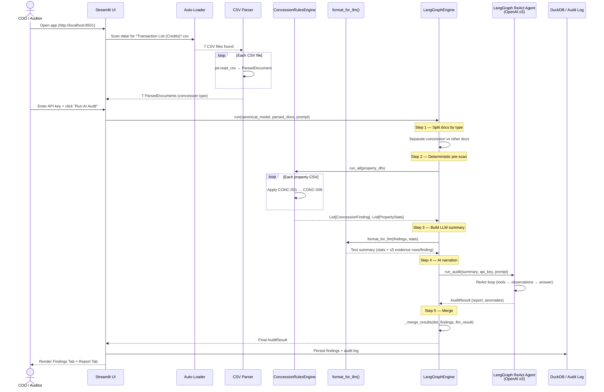
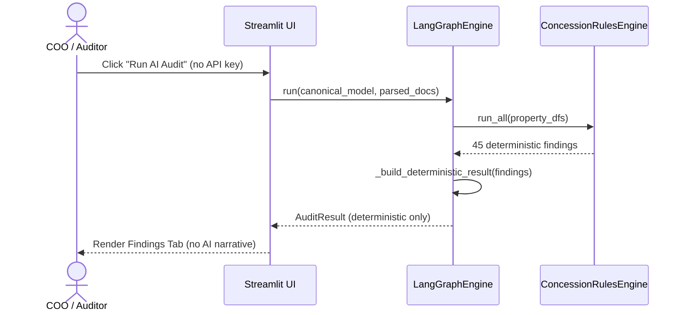

# STREAMLIT AUDIT APP ARCHITECTURE

## LiveNJoy LLC — Concession Audit System

## 1. Purpose

This Streamlit application enables a COO / Auditor to:

- Audit ResMan Transaction List (Credits) CSVs across a multi-property portfolio
- Detect concession anomalies using a **hybrid deterministic + AI pipeline**
- Surface high/critical findings with row-level evidence
- Generate narrative audit reports powered by OpenAI o3
- Drill down to unit-level evidence per property
- Export findings for review

### Supported Data Sources

✅ ResMan Transaction List (Credits) CSV files (auto-loaded from `data/`)

✅ Ad-hoc PDF, Excel, and Word uploads (rent rolls, projections)

## 2. Overall Architecture (Hybrid Pipeline)


```mermaid
graph TB
    %% Actors
    AUD["👤 COO / Auditor"]
    ST["🧩 Streamlit App<br/>(app.py)"]

    %% Data Sources
    subgraph INPUTS["Data Sources"]
        CSV["📊 ResMan Transaction List<br/>(Credits) CSVs"]
        UPLOAD["📄 Ad-hoc Upload<br/>(PDF · Excel · Word)"]
    end

    %% Ingestion Layer
    subgraph INGEST["Ingestion Layer"]
        AUTO_LOAD["Auto-Loader<br/>(data/ directory scan)"]
        CSV_PARSER["CSV Parser"]
        PARSERS["PDF / Excel / Word<br/>Parsers"]
    end

    %% Deterministic Engine
    subgraph DET_ENGINE["Deterministic Pre-Scan"]
        CONC_RULES["ConcessionRulesEngine<br/>(engine/concession_rules.py)"]
        RULES_LIST["8 Rules: CONC-001 … CONC-008"]
        FINDINGS["Structured Findings<br/>(ConcessionFinding)"]
        STATS["Per-Property Stats<br/>(PropertyStats)"]
    end

    %% AI Layer
    subgraph AI_LAYER["AI Narration Layer"]
        FMT["format_for_llm()<br/>Stats + ≤5 evidence rows / finding"]
        AGENT["LangGraph ReAct Agent<br/>(OpenAI o3, 16 384 tokens)"]
        TOOLS["4 Tools<br/>rent_roll · projection<br/>concession · report"]
    end

    %% Merge
    MERGE["Merge & Dedup<br/>(LangGraphEngine._merge_results)"]

    %% Output
    subgraph OUTPUT["Dashboard"]
        FINDINGS_TAB["Findings Tab<br/>(severity table)"]
        REPORT_TAB["Report Tab<br/>(AI narrative)"]
    end

    %% Persistence
    subgraph STORAGE["Persistence (Optional)"]
        DB["DuckDB"]
        LOG["Audit Log (JSONL)"]
    end

    %% Flow
    AUD --> ST
    ST --> INPUTS

    CSV --> AUTO_LOAD
    UPLOAD --> PARSERS

    AUTO_LOAD --> CSV_PARSER
    CSV_PARSER --> CONC_RULES

    CONC_RULES --> RULES_LIST
    RULES_LIST --> FINDINGS
    RULES_LIST --> STATS

    FINDINGS --> FMT
    STATS --> FMT
    FMT --> AGENT
    AGENT --> TOOLS

    PARSERS --> AGENT

    AGENT --> MERGE
    FINDINGS --> MERGE

    MERGE --> OUTPUT
    MERGE --> STORAGE

    FINDINGS_TAB --> LOG
    REPORT_TAB --> LOG
```

### Key Design Decisions

| Decision | Rationale |
|----------|-----------|
| Deterministic rules run **before** the LLM | Reduces token usage ~35 %; ensures every anomaly is caught regardless of LLM hallucination |
| Only stats + ≤ 5 evidence rows sent to AI | LLM narrates findings, it doesn't re-scan raw data |
| No API key → deterministic-only fallback | App is still useful without an OpenAI key |
| Auto-load CSVs from `data/` | Zero-click startup for auditors; no manual upload required |

    EXPLAIN --> KPI
    EXPLAIN --> TREND
    EXPLAIN --> UNIT_VIEW

    UNIT_VIEW --> OVERRIDE
    OVERRIDE --> LOG

    KPI --> EXPORT
    UNIT_VIEW --> EXPORT
```

## 3. Sequence Diagram – Hybrid Audit Pipeline


```mermaid
sequenceDiagram
    actor COO as COO / Auditor
    participant UI as Streamlit UI
    participant LOAD as Auto-Loader
    participant PARSE as CSV Parser
    participant DET as ConcessionRulesEngine
    participant FMT as format_for_llm()
    participant LGE as LangGraphEngine
    participant AGENT as LangGraph ReAct Agent<br/>(OpenAI o3)
    participant DB as DuckDB / Audit Log

    COO->>UI: Open app (http://localhost:8501)
    UI->>LOAD: Scan data/ for *Transaction List (Credits)*.csv
    LOAD-->>PARSE: 7 CSV files found

    loop Each CSV file
        PARSE->>PARSE: pd.read_csv → ParsedDocument
    end

    PARSE-->>UI: 7 ParsedDocuments (concession type)

    COO->>UI: Enter API key + click "Run AI Audit"

    UI->>LGE: run(canonical_model, parsed_docs, prompt)

    Note over LGE: Step 1 — Split docs by type
    LGE->>LGE: Separate concession vs other docs

    Note over LGE: Step 2 — Deterministic pre-scan
    LGE->>DET: run_all(property_dfs)

    loop Each property CSV
        DET->>DET: Apply CONC-001 … CONC-008
    end

    DET-->>LGE: List[ConcessionFinding], List[PropertyStats]

    Note over LGE: Step 3 — Build LLM summary
    LGE->>FMT: format_for_llm(findings, stats)
    FMT-->>LGE: Text summary (stats + ≤5 evidence rows/finding)

    Note over LGE: Step 4 — AI narration
    LGE->>AGENT: run_audit(summary, api_key, prompt)
    AGENT->>AGENT: ReAct loop (tools → observations → answer)
    AGENT-->>LGE: AuditResult (report, anomalies)

    Note over LGE: Step 5 — Merge
    LGE->>LGE: _merge_results(det_findings, llm_result)
    LGE-->>UI: Final AuditResult

    UI->>DB: Persist findings + audit log
    UI-->>COO: Render Findings Tab + Report Tab
```

## 4. Sequence Diagram – No API Key Fallback


```mermaid
sequenceDiagram
    actor COO as COO / Auditor
    participant UI as Streamlit UI
    participant LGE as LangGraphEngine
    participant DET as ConcessionRulesEngine

    COO->>UI: Click "Run AI Audit" (no API key)
    UI->>LGE: run(canonical_model, parsed_docs)
    LGE->>DET: run_all(property_dfs)
    DET-->>LGE: 45 deterministic findings
    LGE->>LGE: _build_deterministic_result(findings)
    LGE-->>UI: AuditResult (deterministic only)
    UI-->>COO: Render Findings Tab (no AI narrative)
```

## 5. Deterministic Concession Rules (engine/concession_rules.py)

Eight rules run on every ResMan Transaction List (Credits) CSV:

| Rule ID | Name | Severity | Logic |
|---------|------|----------|-------|
| CONC-001 | Excessive single concession | HIGH | Amount > $1 000 threshold |
| CONC-002 | $999 special-rate concession | HIGH | Amount == $999 (common special-pricing pattern) |
| CONC-003 | Move-in special | MEDIUM | Description contains "$99 move-in" or "$0 move-in" |
| CONC-004 | Reversed concession | MEDIUM/HIGH | Reverse Date column is populated; HIGH if reversed % > threshold |
| CONC-005 | Duplicate unit concession | MEDIUM | Same Unit appears in multiple rows within the period |
| CONC-006 | Generic / vague description | LOW | Description is "Concession - Rent" with no further detail |
| CONC-007 | High property-level total | HIGH | Property total concession amount > 2× median across all properties |
| CONC-008 | Negative amount | MEDIUM | Amount < 0 (possible data-entry or reversal error) |

### Rule Output

Each rule produces a `ConcessionFinding` with:
- `rule_id`, `severity`, `description`
- `property_name`, `source_file`
- `units` — list of affected unit numbers
- `rows` — list of affected row indices
- `evidence` — up to 5 sample rows as dicts
- `detail` — pre-formatted narrative string

Per-property `PropertyStats` include: total rows, total/avg/max/min amount, reversed count, unique units, multi-concession units, $999 count, move-in count, generic description count, large concession count, negative amount count.

## 6. Data Models

### ConcessionFinding (dataclass)

| Field | Type | Description |
|-------|------|-------------|
| rule_id | str | CONC-001 … CONC-008 |
| rule_name | str | Human-readable rule name |
| severity | str | critical / high / medium / low |
| description | str | Human-readable summary |
| property_name | str | Property name extracted from filename |
| source_file | str | CSV filename |
| units | List[str] | Affected unit numbers |
| rows | List[int] | Affected row indices |
| evidence | List[dict] | Up to 5 sample rows |
| detail | str | Pre-formatted narrative |

### PropertyStats (dataclass)

| Field | Type | Description |
|-------|------|-------------|
| property_name | str | Property name |
| total_rows | int | Row count in CSV |
| total_amount | float | Sum of concession amounts |
| avg_amount | float | Mean concession |
| unique_units | int | Distinct units with concessions |
| reversed_count | int | Rows with Reverse Date populated |
| specials_999_count | int | $999 special rows |
| … | … | 10+ additional pre-computed metrics |

### AuditResult (dataclass)

| Field | Type | Description |
|-------|------|-------------|
| report | str | AI-generated narrative or deterministic summary |
| anomalies | List[dict] | Merged findings list |
| severity_counts | dict | {critical: N, high: N, …} |
| raw_output | str | Raw LLM response |
| prompt_used | str | Prompt sent to AI |

## 7. Project Structure

```
streamlit-audit-agent-loriaa/
│
├── app.py                          # Main Streamlit application
├── audit_engine.py                 # Metrics computation helpers
├── requirements.txt                # Python dependencies
├── Dockerfile                      # Container build definition
│
├── agents/
│   └── audit_agent.py              # LangGraph ReAct agent (4 tools, o3)
│
├── config/
│   ├── settings.py                 # Application configuration
│   └── mappings.yaml               # Category mappings
│
├── data/
│   ├── *.csv                       # 7 ResMan Transaction List CSVs
│   ├── audit.duckdb                # Optional DuckDB persistence
│   └── audit_log.jsonl             # Audit trail
│
├── engine/
│   ├── concession_rules.py         # ★ Deterministic rules (CONC-001 … CONC-008)
│   ├── langgraph_engine.py         # ★ Hybrid pipeline orchestrator
│   ├── date_range_engine.py        # Date filtering and aggregation
│   ├── rules.py                    # Legacy rules engine
│   ├── anomaly_detector.py         # Anomaly detection orchestrator
│   └── explainability.py           # Human-readable explanations
│
├── ingestion/
│   ├── loader.py                   # Unified file loader
│   ├── resman_client.py            # ResMan API client (stub)
│   └── parsers/
│       ├── csv_parser.py           # CSV parsing logic
│       ├── pdf_parser.py           # PDF parsing logic
│       ├── excel_parser.py         # Excel/CSV parsing
│       └── docx_parser.py          # Word document parsing
│
├── models/
│   ├── unit.py                     # Unit, Transaction, Lease, Finding models
│   └── canonical_model.py          # Data normalization
│
├── storage/
│   ├── database.py                 # DuckDB persistence
│   └── audit_log.py                # Audit trail logging
│
├── ui/
│   ├── filters.py                  # Sidebar filters
│   ├── dashboard.py                # KPI overview
│   ├── charts.py                   # Revenue trend charts
│   ├── unit_view.py                # Unit drilldown
│   ├── findings.py                 # Audit findings table
│   ├── override.py                 # Override panel
│   ├── export.py                   # Export functionality
│   └── tabs/
│       ├── findings_tab.py         # Findings tab (severity table)
│       ├── report_tab.py           # Report tab (AI narrative)
│       ├── rent_roll_tab.py        # Rent roll tab
│       ├── projection_tab.py       # Projection tab
│       └── concession_tab.py       # Concession tab
│
├── utils/
│   ├── helpers.py                  # Utility functions
│   ├── data_processor.py           # Data summary producer
│   └── validations.py              # Input validation
│
└── tests/                          # pytest test suite
```

## 8. Token Optimization Strategy

The hybrid pipeline sends **only** the following to the LLM (via `format_for_llm()`):

1. **Per-property stats block** — total rows, total amount, average, max, min, reversed count, unique units, etc.
2. **Per-finding summary** — rule ID, severity, description, count of affected units/rows
3. **Up to 5 evidence rows per finding** — actual CSV row data as key-value pairs

This replaces sending all raw CSV rows (393 total across 7 properties), resulting in ~35% token reduction while giving the AI **better** context because each row is already classified.

## 9. Architectural Design Principles

| Concern | Layer |
|---------|-------|
| Data retrieval | `ingestion/` |
| Deterministic audit | `engine/concession_rules.py` |
| AI narration | `agents/audit_agent.py` + `engine/langgraph_engine.py` |
| Pipeline orchestration | `engine/langgraph_engine.py` |
| UI rendering | `ui/` |
| Persistence | `storage/` |

This separation allows:

- Running deterministic audit without an API key
- Swapping the LLM model without touching rule logic
- Adding new CONC rules without modifying the AI prompt
- Scaling to additional property types or data sources
- Converting into a nightly batch job or FastAPI service

## 10. Future Evolution

- FastAPI backend service for headless audits
- Celery nightly audit jobs
- Loriaa Audit Agent integration
- Portfolio-level cross-property analytics
- Additional rule families (rent roll, projection) in the deterministic engine