# STREAMLIT AUDIT APP ARCHITECTURE

## Property Recurring Transaction & Concession Audit System

## 1. Purpose

This Streamlit application enables a COO / Auditor to:

- Analyze recurring rent, credits, concessions, and fees
- Detect anomalies across a selected date range
- Identify lease cliffs and revenue decay
- Flag concession mismatches
- Validate recurring charge templates
- Drill down to unit-level evidence
- Override findings with audit trail
- Export evidence packages

### Supported Data Sources

✅ Direct ResMan API sync

✅ Ad-hoc PDF uploads

✅ Ad-hoc Excel report uploads

## 2. Overall Architecture

```mermaid
graph TB
    %% Actors
    AUD["👤 COO / Auditor"]
    ST["🧩 Streamlit App"]

    %% Data Sources
    subgraph INPUTS["Data Sources"]
        RESMAN["🌐 ResMan API"]
        PDF["📄 PDF Upload"]
        XLS["📊 Excel Upload"]
    end

    %% Ingestion Layer
    subgraph INGEST["Ingestion Layer"]
        RES_CLIENT["ResMan Client"]
        PDF_PARSER["PDF Parser"]
        XLS_PARSER["Excel Parser"]
    end

    %% Normalization
    subgraph CANON["Canonical Model Layer"]
        MAPPER["Category Mapping"]
        NORMALIZER["Data Normalizer"]
        FACT_TABLES["Fact Tables<br/>Units · Charges · Credits · Leases"]
    end

    %% Processing Engine
    subgraph ENGINE["Validation & Analytics Engine"]
        DATE_RANGE["Date Range Engine"]
        RULES["Validation Rules Engine"]
        ANOMALY["Anomaly Detector"]
        EXPLAIN["Explainability Layer"]
    end

    %% Storage
    subgraph STORAGE["Persistence"]
        DB["DuckDB / SQLite"]
        LOG["Audit Log"]
    end

    %% UI Layer
    subgraph OUTPUT["Dashboard"]
        KPI["KPI Overview"]
        TREND["Revenue Trend & Lease Cliff View"]
        UNIT_VIEW["Unit Drilldown"]
        OVERRIDE["Override Panel"]
        EXPORT["Export Engine"]
    end

    %% Flow
    AUD --> ST
    ST --> INPUTS

    RESMAN --> RES_CLIENT
    PDF --> PDF_PARSER
    XLS --> XLS_PARSER

    RES_CLIENT --> NORMALIZER
    PDF_PARSER --> NORMALIZER
    XLS_PARSER --> NORMALIZER

    NORMALIZER --> MAPPER
    MAPPER --> FACT_TABLES

    FACT_TABLES --> DATE_RANGE
    DATE_RANGE --> RULES
    RULES --> ANOMALY
    ANOMALY --> EXPLAIN

    EXPLAIN --> DB
    EXPLAIN --> LOG

    EXPLAIN --> KPI
    EXPLAIN --> TREND
    EXPLAIN --> UNIT_VIEW

    UNIT_VIEW --> OVERRIDE
    OVERRIDE --> LOG

    KPI --> EXPORT
    UNIT_VIEW --> EXPORT
```



## 3. Sequence Diagram – COO/Auditor Workflow


## 4. Analytical Engine (Derived from Real Report Findings)

Based on the Village Green recurring projection analysis:

### A. Lease Cliff Detection

Revenue dropped dramatically over the projection period.

```
Rule
IF monthly_rent_drop > 20%
FLAG: LEASE_CLIFF_RISK
```

Output:

- Lease expiration heatmap
- Month-over-month revenue decay chart

### B. Concession Misalignment

Observed pattern:

- Rent changed unexpectedly
- Concession applied in wrong month
- Partial rent without expected proration

```
Rules
IF rent_amount != lease_contract_rent
AND no valid proration
FLAG: RENT_PRORATION_MISMATCH

IF concession_month NOT aligned with lease incentive
FLAG: CONCESSION_MISALIGNED

IF concession_amount > 50% of rent
FLAG: EXCESSIVE_CONCESSION
```

### C. Recurring Fee Template Validation

Standard recurring template:

| Fee | Amount |
|-----|--------|
| Billing Fee | $5 |
| Cable | $55 |
| CAM | $10 |
| HOA | $2.50 |
| Trash | $10 |
| Valet Trash | $35 |
| Package Locker | $9 |
| Pest Control | $8 |
|
```
Rules
IF recurring_fee_missing AND lease_active
FLAG: MISSING_RECURRING_CHARGE

IF recurring_fee_amount != template_amount
FLAG: FEE_AMOUNT_MISMATCH
```

### D. Employee Unit vs Concession Conflict

```
IF employee_unit == TRUE
AND concession_present == TRUE
FLAG: DOUBLE_DISCOUNT_RISK
```

## 5. Canonical Data Model

**fact_recurring_transactions**

| unit_id | category | amount | month | source |
|---------|----------|--------|-------|--------|

**fact_lease_terms**

| unit_id | lease_start | lease_end | rent | concession_amount |
|---------|-------------|-----------|------|-------------------|

**audit_findings**

| finding_id | unit_id | rule_id | severity | month | delta | evidence_json | status | notes |
|------------|---------|---------|----------|-------|-------|---------------|--------|-------|

## 6. Recommended Code Structure

```
streamlit-audit-app/
│
├── app.py
│
├── config/
│   ├── settings.py
│   └── mappings.yaml
│
├── ingestion/
│   ├── resman_client.py
│   ├── pdf_parser.py
│   ├── excel_parser.py
│   └── loader.py
│
├── models/
│   ├── canonical_model.py
│   ├── unit.py
│   ├── recurring_transaction.py
│   └── lease.py
│
├── engine/
│   ├── date_range_engine.py
│   ├── rules.py
│   ├── anomaly_detector.py
│   └── explainability.py
│
├── storage/
│   ├── database.py
│   └── audit_log.py
│
├── ui/
│   ├── dashboard.py
│   ├── unit_view.py
│   ├── filters.py
│   └── export.py
│
└── utils/
    ├── helpers.py
    └── validations.py
```

## 7. Date Range Analytics Design

The Date Range Engine:

Filters canonical table by:

- `start_month`
- `end_month`

Aggregates:

- Gross Rent
- Credits
- Net Rent
- Concession %

Produces:

- Revenue waterfall
- Concession ratio trend
- Lease expiration heatmap
- Flag density by month

## 8. Architectural Design Principles

| Concern | Layer |
|---------|-------|
| Data retrieval | `ingestion/` |
| Standardization | `models/` |
| Business rules | `engine/` |
| UI rendering | `ui/` |
| Persistence | `storage/` |

This separation allows:

- Switching between PDF, Excel, and ResMan without changing validation logic
- Reusing rule engine in Loriaa backend
- Converting into nightly batch job
- Scaling to multi-property portfolio

## 9. Future Evolution

This standalone app can evolve into:

- FastAPI backend service
- Celery nightly audit job
- Loriaa Audit Agent integration
- Portfolio-level analytics